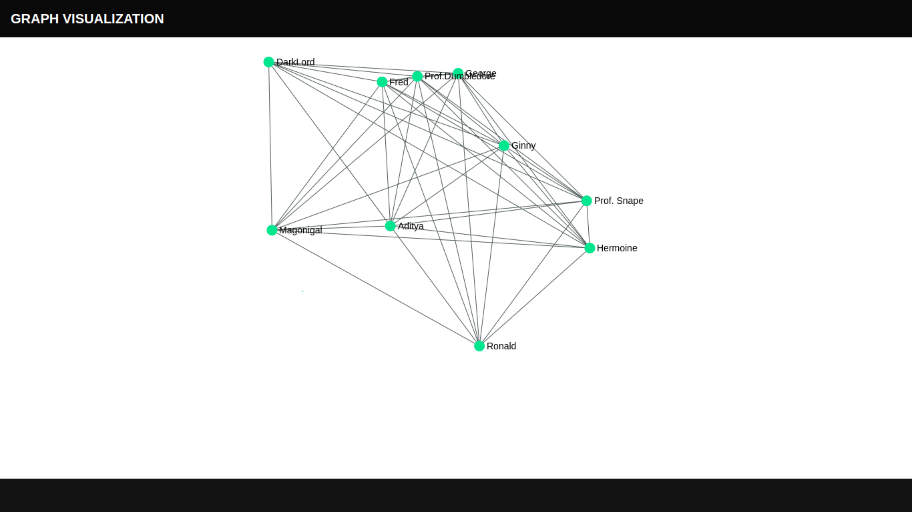

# Task:
Graph_Visualization
1) Make a private Gitlab repository and commit regularly during the coding. 
2) Install latest Node.js (better via nvm) on your computer and then install create-react-app 
3) Remove content from the main page 
4) Install react-bootstrap (it is beta, so what is not implemented -- can be written using html classes)  
5) Make a page with a header/footer (as React components) and put the graph (subtask 6) in the middle of the page (horizontally and vertically aligned). 
6) Install react-sigma and display a graph, that has nodes and edges labels.

# Requirements:
1. node.js
2. create-react-app
3. react-bootstrap
4. react-sigma

# About Graph_Visualization:
I have made an app called my-app under Graph_Visualization using npm. As mentioned in the task i have created:
1. Header and Footer.
2. A simple Harry Potter based nodes and edges, displayed vertically and horizontally aligned.

# Graph view using react-sigma:

